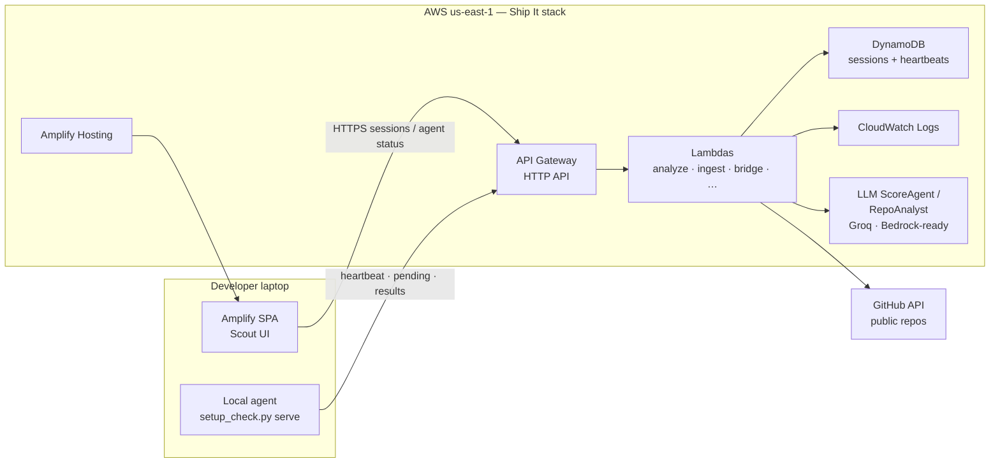
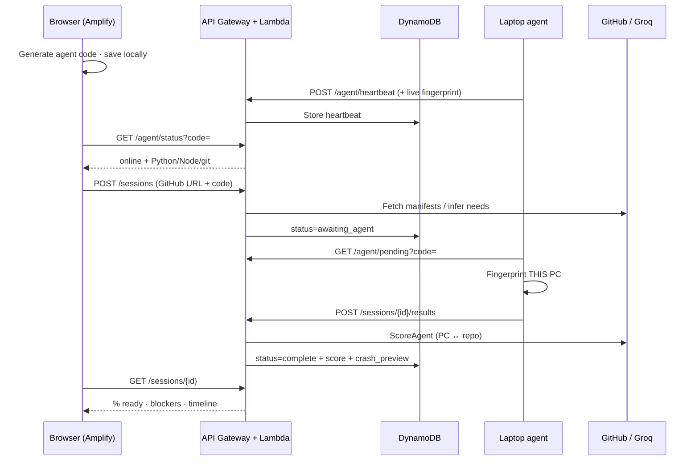

# Scout

### Will this repo run on *your* laptop — before you waste hours finding out?

**AWS Ship It hackathon · Track: Ship It (deployed on AWS)**  
**Live app:** [https://main.d3qwc7ge49pla9.amplifyapp.com](https://main.d3qwc7ge49pla9.amplifyapp.com)  
**API:** [https://7j9hs02vo4.execute-api.us-east-1.amazonaws.com](https://7j9hs02vo4.execute-api.us-east-1.amazonaws.com) · `GET /health`

> Students, hackathon teammates, and juniors constantly lose evenings to “dependency hell”: wrong Python, missing Node, never-pushed `node_modules`, silent env crashes. CI and Dev Containers assume scaffolding already exists. **Scout gives one readiness score for *this PC* vs *this project*, plus an ordered future-crash timeline — and never installs anything until you approve.**

---

## At a glance

| | |
| --- | --- |
| **Problem** | Setup hell before the first `npm start` / `python app.py` — CI and READMEs don’t measure *your* laptop |
| **Outcome** | One readiness %, ordered crash preview, install list — nothing runs until you approve |
| **AWS (Ship It)** | Lambda · API Gateway · DynamoDB · Amplify Hosting · SAM · CloudWatch · LLM agents in the API path |
| **Works today** | Paste a GitHub URL or local path → laptop agent fingerprints this PC → score + timeline |

---

## The problem (why this exists)

| What people try | Why it fails them |
| --- | --- |
| README / “works on my machine” | Written for the author’s laptop, not yours |
| CI green | Tests a clean Linux image — not your Windows PATH |
| AI “fix my deps” chatbots | Guess from text; never measure *your* installed runtimes |
| Dev Containers / Docker-first | Heavy; many student repos have no Dockerfile |
| Cloning + `npm install` blind | Failures appear late; `node_modules` was never in Git |

**Scout’s bet:** separate **what the repo needs** (cloud) from **what this laptop has** (local agent). Compare them. Show the first crash you’ll hit if you run it *now*.

---

## What you get (working product)

1. **One readiness %** — PC vs repo, not vs AWS Lambda  
2. **Compat table** — Python/Node/git/services: repo needs ↔ this PC has  
3. **Future-crash preview** — ordered failures (runtime → install → env → boot)  
4. **Approve-to-install** — fingerprint first; installs only after UI confirmation  
5. **Two modes** — public **GitHub URL** or **local folder** on disk  
6. **Laptop link via agent code** — works from Amplify HTTPS (Chrome blocks loopback)

---

## Architecture (Ship It)



### Why a local agent? (design constraint, not a shortcut)

Browsers on **Amplify HTTPS cannot call `http://127.0.0.1`** (Private Network Access / loopback). So the laptop agent **polls the cloud** with a short **agent code**. The UI and agent share that code; AWS never pretends to be your PC.



---

## AWS services used (Ship It mandatory map)

| Ship It category | Service | Role in Scout |
| --- | --- | --- |
| **Serverless** | **AWS Lambda** | Analyze repo, ingest fingerprint, agent bridge, health |
| **Serverless** | **API Gateway** (HTTP API) | Public HTTPS API for UI + agent |
| **Serverless** | **SAM** (`backend/template.yaml`) | IaC build & deploy |
| **Data** | **DynamoDB** | Sessions + agent heartbeats |
| **Hosting** | **Amplify Hosting** | SPA at a public URL |
| **Plumbing** | **CloudWatch Logs** | Per-function observability (SAM default) |
| **Agents & AI** | **LLM agents in Lambda** | RepoAnalyst + ScoreAgent + BlockerAuditor (+ DiagnoseAgent). **Groq** in this deploy (`BEDROCK_DISABLED=1`); **Bedrock** path remains in code for accounts with model access |
| **Open source / local** | **SAM CLI**, Python agent | Local Build It path via `backend/dev_server.py` |

**Cost posture:** pay-per-request DynamoDB + Lambda + Amplify free tier–friendly. No always-on EC2. LLM calls only when a session is scored.

---

## Try it (60 seconds)

1. Open **[Scout](https://main.d3qwc7ge49pla9.amplifyapp.com)** (hard-refresh if needed).  
2. **Copy PowerShell command** → run in a terminal → leave window open.  
3. Wait until UI shows **laptop linked** and your real Python / Node / git.  
4. Paste a public repo (e.g. `https://github.com/pallets/flask`) → **Check my laptop**.  
5. Read **% ready**, **compat table**, **future-crash preview**.  
6. Optional: **Stop agent** from the UI when done.

Health check:

```powershell
curl https://7j9hs02vo4.execute-api.us-east-1.amazonaws.com/health
```

Expect `llm.enabled: true` and provider `groq` (or bedrock when enabled).

---

## What we learned building this

1. **SAM → Lambda + HTTP API + DynamoDB** end-to-end deploy (`sam build` / `sam deploy`).  
2. **Amplify Hosting** for a Vite SPA with baked-in `VITE_API_URL`.  
3. **Browser security:** HTTPS pages cannot fingerprint a laptop via loopback — so we use **agent-code polling** instead.  
4. **Multi-agent LLM pipeline** (analyst → score → audit) with a heuristic baseline when the model returns empty content.  
5. **Groq as production LLM** when Bedrock model access wasn’t available; Bedrock wiring kept for portability.  
6. **Windows tooling quirks:** Store `python` stubs, `py -3`, PATH refresh, Smart App Control blocking `.cmd` downloads → PowerShell + agent code as the primary link path.

---

## Repository layout

```text
repo-checker/
├── README.md                 ← product overview
├── amplify.yml               ← Amplify build
├── frontend/                 ← React + Vite + Tailwind → Amplify
├── backend/
│   ├── template.yaml         ← SAM: Lambda + API Gateway + DynamoDB
│   ├── deploy.ps1            ← one-shot deploy (Groq key from .env)
│   ├── lambdas/              ← thin handlers
│   └── shared/
│       ├── agents.py         ← RepoAnalyst · ScoreAgent · Auditor
│       ├── crash_preview.py  ← future-crash timeline
│       ├── service.py        ← session lifecycle
│       └── store.py          ← DynamoDB / local file store
└── agent/
    └── setup_check.py        ← laptop agent (also served as /agent.py)
```

---

## Local development (Build It–compatible)

```powershell
# API + optional local scoring
cd backend
pip install -r requirements.txt
# Optional: set GROQ_API_KEY in repo-root .env
python dev_server.py
```

```powershell
# UI
cd frontend
npm install
$env:VITE_API_URL="http://127.0.0.1:8787"
npm run dev
```

```powershell
# Laptop agent (if not auto-started)
python agent/setup_check.py serve --api http://127.0.0.1:8787 --code <your-code>
```

---

## Deploy to AWS (Ship It)

### Backend

```powershell
# Repo root .env must contain: GROQ_API_KEY=...
cd backend
.\deploy.ps1
```

Stack name: `setup-readiness` · Region: `us-east-1` · Output: **ApiBaseUrl**

### Frontend

Build with API URL baked in, deploy `frontend/dist` to Amplify (or Git-connected app using `amplify.yml`):

```powershell
cd frontend
$env:VITE_API_URL="https://YOUR_API.execute-api.us-east-1.amazonaws.com"
npm run build
```

Set Amplify env for Git builds: `VITE_API_URL`, `VITE_AGENT_URL=http://127.0.0.1:9877`.

---

## Safety model

| Action | Default |
| --- | --- |
| Fingerprint OS / Python / Node / git | Automatic once agent linked |
| `npm install` / `pip install` / winget | **Only after UI Approve** |
| Boot / health check | **Only after UI Approve** |
| Cloud sees local source | Manifests/snippets only (local mode), not full drive |

---

## Scoring signals (product, not hackathon)

| Signal | Weight | Notes |
| --- | --- | --- |
| Runtime match | ~50% | Python/Node vs this laptop |
| Tooling | ~25% | git, pip/npm |
| Env / services | ~10% | collapsed config cards |
| Install / boot proof | ~15% | optional until approved |

GitHub clones do **not** spam missing `node_modules` packages (those folders are never pushed). Local folders still surface missing deps.

---

## One-liner

**Scout** — serverless setup readiness on Amplify + Lambda + DynamoDB: a local laptop agent and LLM ScoreAgent so you know what to install *before* the first crash.

---

## License / notes

Hackathon prototype. Do not commit `.env` or API keys. Groq key is injected at deploy via SAM parameter `GroqApiKey` (`NoEcho`).
